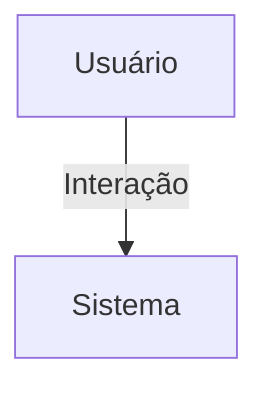

## 1. Visão Geral

<descrição curta>

## 2. Escopo
- **Inclui**:
- **Exclui**:

## 3. Requisitos Funcionais
| Código | Descrição | Prioridade | Critérios de Aceite |
|--------|-----------|-----------|---------------------|

## 4. Requisitos Não-Funcionais
| Código | Categoria | Descrição | Métrica/Meta |
|--------|-----------|-----------|--------------|

## 5. Fluxo de Usuário / Caso de Uso


### UC-01 – Descrição

## 6. Regras de Negócio

## 7. Modelo de Dados

## 8. Critérios de Aceite (Gherkin)
```gherkin
Feature: <nome>
```

## 9. Dependências / Integrações

## 10. Anexos e Referências
- Documento fonte: Requisitos_Accounts_Hubx.pdf

## 99. Conteúdo Importado (para revisão)

```
Requisitos do Domínio: Accounts - Sistema Hubx (Atualizado com Avatar e Capa)
1. MODELO USER (completo)
Herança:
- AbstractUser
- TimeStampedModel
Campos adicionais:
- nome_completo: CharField(max_length=150)
- cpf: CharField(max_length=14, unique=True)
- email: EmailField(unique=True)
- avatar: ImageField(upload_to='usuarios/avatars/', blank=True, null=True)
- cover: ImageField(upload_to='usuarios/capas/', blank=True, null=True)
- biografia: TextField(blank=True)
- endereco: CharField(max_length=255)
- estado: CharField(max_length=2)
- cep: CharField(max_length=9)
- fone: CharField(max_length=15)
- whatsapp: CharField(max_length=15)
- redes_sociais: JSONField(blank=True, null=True)
- organizacao: ForeignKey('Organizacao', on_delete=PROTECT, null=True)
- is_associado: BooleanField(default=False)
- is_active: BooleanField(default=True)
- nucleos: ManyToManyField('Nucleo', through='ParticipacaoNucleo', related_name='usuarios')
Autenticação:
- USERNAME_FIELD = 'email'
- REQUIRED_FIELDS = ['username']
Métodos utilitários:

- get_tipo_usuario()
- is_coordenador_do(nucleo)
2. MODELO INTERMEDIÁRIO: ParticipacaoNucleo
- user: ForeignKey(User, on_delete=CASCADE)
- nucleo: ForeignKey(Nucleo, on_delete=CASCADE)
- is_coordenador: BooleanField(default=False)
- unique_together = ('user', 'nucleo')
3. TIPOS LÓGICOS DE USUÁRIO
- root: is_superuser == True
- admin: is_staff == True and not is_associado
- convidado: not is_staff and not is_associado
- associado: is_associado == True and sem núcleo
- nucleado: is_associado == True e com vínculo com núcleo(s)
- coordenador: is_associado == True e coordena núcleo(s)
4. COMPORTAMENTOS ESPERADOS
- Login, edição de perfil, alteração de senha
- Dashboard direcionado por tipo lógico
- Permissões e escopo baseados em organizacao e núcleo
- Validação única de email globalmente
- Avatar e capa são visuais opcionais no perfil
5. PERMISSÕES
- IsRoot
- IsAdmin
- IsAssociado
- IsNucleado

- IsCoordenadorDoNucleo
6. CRITÉRIOS DE ACEITAÇÃO
- Modelo compatível com AbstractUser
- Campo email obrigatório e único no sistema
- Campo organizacao obrigatório (exceto root)
- Permissões e filtros aplicados em endpoints
- Upload opcional de avatar e capa do usuário
- Testes unitários para:
- Criação de usuários por tipo
- Escopo por organização
- Permissões por tipo
- Upload e exibição de avatar e capa
```
