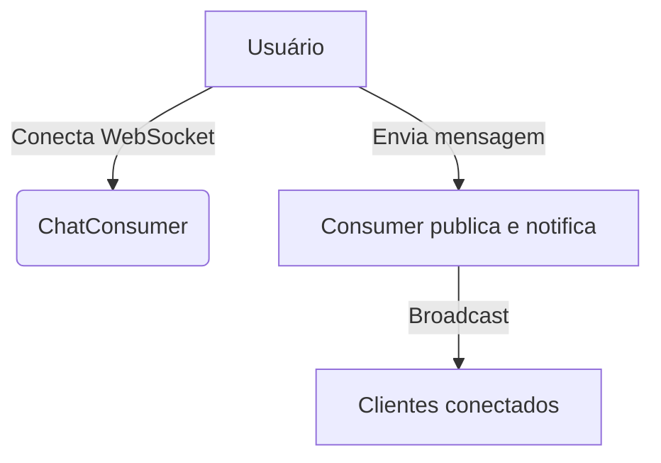

## 1. Visão Geral

O App Chat deve permitir comunicação em tempo real via WebSocket e interface visual entre usuários em diferentes contextos organizacionais (privado, núcleo, evento e organização), de forma modular e reutilizável fileciteturn2file1.

## 2. Escopo
- **Inclui**  
  - Chat privado (1:1) entre dois usuários do mesmo núcleo.  
  - Chat de núcleo: canal coletivo para membros de um núcleo.  
  - Chat de evento: canal para participantes de um evento.  
  - Chat de organização: canal público para associados e admins.  
- **Exclui**  
  - Ferramentas de edição de mensagem (além de edição básica).  
  - Armazenamento offline dos chats.

## 3. Requisitos Funcionais

- **RF-01**  
  - **Descrição**: Suporte a WebSocket para comunicação em tempo real.  
  - **Prioridade**: Alta  
  - **Critérios de Aceite**: Conexão estável e bidirecional via `ws/chat/.../`.  

- **RF-02**  
  - **Descrição**: Envio e recebimento de mensagens de texto, imagem, vídeo e arquivo.  
  - **Prioridade**: Alta  
  - **Critérios de Aceite**: Suporta tipos `text`, `image`, `video`, `file`.  

- **RF-03**  
  - **Descrição**: Validação de escopo: usuário deve pertencer ao contexto (núcleo, evento ou organização).  
  - **Prioridade**: Alta  
  - **Critérios de Aceite**: Verifica `user.context_id` antes de publicar mensagem. fileciteturn2file1  

- **RF-04**  
  - **Descrição**: Notificação de novas mensagens em tempo real.  
  - **Prioridade**: Média  
  - **Critérios de Aceite**: Notificações aparecem no frontend sem refresh.  

- **RF-05**  
  - **Descrição**: Permissões extras para admins: fixar mensagens e exportar histórico.  
  - **Prioridade**: Baixa  
  - **Critérios de Aceite**: Admin pode fixar `</pin>` e baixar histórico via endpoint.  

## 4. Requisitos Não-Funcionais

- **RNF-01**  
  - **Categoria**: Desempenho  
  - **Descrição**: Latência máxima de resposta do WebSocket  
  - **Métrica/Meta**: p95 ≤ 200 ms  

- **RNF-02**  
  - **Categoria**: Manutenibilidade  
  - **Descrição**: Código modular e documentado  
  - **Métrica/Meta**: Cobertura ≥ 90 %  

## 5. Fluxo de Usuário / Caso de Uso

### UC-01 – Comunicação em Tempo Real
1. Usuário acessa a página de chat e estabelece conexão WebSocket.  
2. Envia mensagem via `ChatConsumer`.  
3. Mensagem é validada e retransmitida a todos os participantes do canal.

## 6. Modelo de Dados

O modelo de mensagens e notificações está baseado em classes descritas no documento de explicação técnica fileciteturn2file0:

- **Mensagem**  
  - `remetente`, `destinatario`, `nucleo`, `evento`, `organizacao`.  
  - `tipo`: `'text'|'image'|'video'|'file'`.  
  - `conteudo`: texto ou URL.  
  - Regras: apenas um escopo deve ser definido por mensagem.

- **Notificação**  
  - `usuario`, `remetente`, `mensagem`, `lida`.  
  - Usado para alertas de novas mensagens.

## 7. Regras de Negócio
- Usuário deve estar autenticado e ter vínculo com o contexto.  
- Administradores podem fixar e exportar mensagens.

## 8. Critérios de Aceite (Gherkin)
```gherkin
Feature: Chat em tempo real
  Scenario: Envio de mensagem de texto
    Given usuário autenticado no canal de organização
    When envia "Olá, mundo!"
    Then todos no canal recebem "Olá, mundo!"
```

## 9. Dependências / Integrações
- **WebSocket**: consumers em `chat/consumers.py`.  
- **Models**: `chat.models.Mensagem`, `chat.models.Notificacao`.  
- **Views HTTP**: modal de chat em `views/chat.py`. fileciteturn2file1

## 10. Anexos e Referências
- `requisitos_app_chat_hubx.pdf`  
- `explicacao_modelo_chat.pdf`

## 99. Conteúdo Importado (para revisão)
```
# Do requisitos_app_chat:
Objetivo Geral ...  
Escopos de Chat Suportados ...  

# Do explicacao_modelo_chat:
Classe Mensagem ...  
Classe Notificacao ...  
Design e Flexibilidade ...  
```
