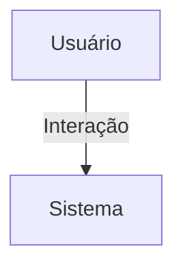

## 1. Visão Geral

<descrição curta>

## 2. Escopo
- **Inclui**:
- **Exclui**:

## 3. Requisitos Funcionais
| Código | Descrição | Prioridade | Critérios de Aceite |
|--------|-----------|-----------|---------------------|

## 4. Requisitos Não-Funcionais
| Código | Categoria | Descrição | Métrica/Meta |
|--------|-----------|-----------|--------------|

## 5. Fluxo de Usuário / Caso de Uso


### UC-01 – Descrição

## 6. Regras de Negócio

## 7. Modelo de Dados

## 8. Critérios de Aceite (Gherkin)
```gherkin
Feature: <nome>
```

## 9. Dependências / Integrações

## 10. Anexos e Referências
- Documento fonte: requisitos_app_chat_hubx.pdf

## 99. Conteúdo Importado (para revisão)

```
Requisitos do App Chat - HubX
Objetivo Geral
Permitir comunicação em tempo real via WebSocket e interface visual entre usuários em diferentes contextos
organizacionais. O app deve ser modular e reutilizável.
Escopos de Chat Suportados
- Privado (1:1): entre dois usuários do mesmo núcleo.
- Núcleo: entre todos os membros de um núcleo.
- Evento: entre participantes inscritos em um evento.
- Organização: entre todos os associados e admins da organização.
Chat da Organização
Público-alvo:
- Todos os usuários com vínculo organizacional, incluindo associados e admins.
Funcionalidades:
- Canal coletivo único por organização.
- Mensagens visíveis para todos os associados e admins.
- Suporte a texto, imagens, vídeos e arquivos.
Validações:
- O usuário deve pertencer à organização (`user.organizacao_id == context_id`).
- O tipo do usuário deve ser associado ou admin.
Requisitos Técnicos
- Adicionar campo `organizacao` ao modelo `Mensagem`:
organizacao = models.ForeignKey(Organizacao, null=True, blank=True, on_delete=models.CASCADE)
- Consumer WebSocket deve validar o vínculo do usuário com a organização.
- View HTTP para modal de chat organizacional.
- Rota WebSocket: ws/chat/organizacao/<org_id>/
Observações Adicionais
- A associação à organização é obrigatória para participar do canal.
- Interface pode exibir notificações ou badges para novas mensagens.
- Admins podem ter permissões extras como fixar mensagens ou exportar histórico.
```
