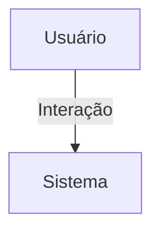

## 1. Visão Geral

<descrição curta>

## 2. Escopo
- **Inclui**:
- **Exclui**:

## 3. Requisitos Funcionais
| Código | Descrição | Prioridade | Critérios de Aceite |
|--------|-----------|-----------|---------------------|

## 4. Requisitos Não-Funcionais
| Código | Categoria | Descrição | Métrica/Meta |
|--------|-----------|-----------|--------------|

## 5. Fluxo de Usuário / Caso de Uso


### UC-01 – Descrição

## 6. Regras de Negócio

## 7. Modelo de Dados

## 8. Critérios de Aceite (Gherkin)
```gherkin
Feature: <nome>
```

## 9. Dependências / Integrações

## 10. Anexos e Referências
- Documento fonte: Requisitos_Configuracoes_Conta_Hubx.pdf

## 99. Conteúdo Importado (para revisão)

```
Requisitos do Domínio: Configurações de Conta - Sistema Hubx
1. MODELO CONFIGURACAO DE CONTA
Herança:
- TimeStampedModel
Campos adicionais:
- user: OneToOneField(User, on_delete=CASCADE, related_name='configuracoes')
- receber_notificacoes_email: BooleanField(default=True)
- receber_notificacoes_whatsapp: BooleanField(default=False)
- tema_escuro: BooleanField(default=False)
2. COMPORTAMENTO ESPERADO
- Cada usuário deve possuir exatamente uma configuração de conta.
- As configurações são criadas automaticamente no momento do cadastro do usuário.
- As preferências controlam notificações e exibição da interface.
3. REGRAS
- A configuração deve ser criada uma única vez por usuário.
- O modelo é opcionalmente expandido para armazenar futuras preferências.
- Os campos de notificação e interface são independentes de lógica de permissão.
4. CRITÉRIOS DE ACEITAÇÃO
- Existência de instância única por usuário.
- Preferências aplicadas com base no relacionamento direto com o usuário.
- Cobertura de testes para:
- Criação automática de configuração.

- Validação da integridade da relação 1:1.
- Atualização de valores sem violação de unicidade.
```
