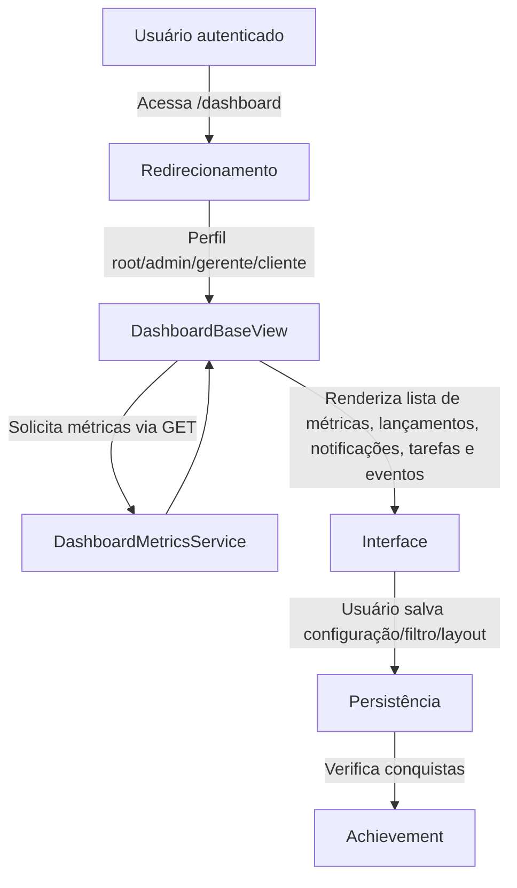

## 1. Visão Geral

Fornecer painéis dinâmicos de métricas, estatísticas e indicadores para diferentes tipos de usuário do Hubx, permitindo que cada pessoa personalize filtros, layouts e exportações conforme suas necessidades.  O dashboard integra dados de diversos módulos (Agenda, Financeiro, Feed, Chat, Discussão, Tokens, etc.) e pode ser estendido por novos aplicativos.

## 2. Escopo

- **Inclui**
  - Exibição de métricas agregadas e variação percentual por período e escopo.
  - Criação, salvamento e compartilhamento de configurações de dashboards e filtros personalizados.
  - Personalização de layout (arranjo dos widgets) e seleção de métricas exibidas.
  - Exportação de métricas em múltiplos formatos (CSV, PDF, XLSX, PNG).
  - Sistema de conquistas para incentivar o uso de funcionalidades.
  - Endpoints de dados parciais via HTMX para atualizar seções específicas sem recarregar a página.
- **Exclui**
  - Alteração ou inclusão de dados de origem (os dashboards apenas leem dados de outros módulos).
  - Configuração de permissões de acesso (tratada no módulo de contas).

## 3. Requisitos Funcionais

- **RF‑01 – Filtragem Parametrizada**
  - Descrição: As views base de dashboard devem aceitar parâmetros via `request.GET` para selecionar **período** (`mensal`, `trimestral`, `semestral`, `anual`), **escopo** (`global`, `organizacao`, `nucleo`, `evento` ou `auto`) e filtros opcionais (`data_inicio`, `data_fim`, `organizacao_id`, `nucleo_id`, `evento_id`, `metricas`).
  - Prioridade: Alta
  - Critérios de Aceite:  Chamadas com parâmetros válidos retornam métricas corretas; parâmetros inválidos geram erros claros.

- **RF‑02 – Serviço de Métricas**
  - Descrição: A função `get_metrics()` deve receber usuário, período, intervalo de datas, escopo e filtros adicionais e retornar um dicionário de métricas agregadas com `total` e `crescimento` percentual.  Os resultados devem ser cacheados por 5 minutos.
  - Prioridade: Alta
  - Critérios de Aceite: Métricas são calculadas conforme filtros; valores repetidos dentro do TTL de cache retornam rapidamente; variação percentual utiliza função `get_variation()`.

- **RF‑03 – Cálculo de Variação**
  - Descrição: A função `get_variation(previous_value, current_value)` deve retornar a variação percentual, usando `1` como denominador mínimo para evitar divisão por zero.
  - Prioridade: Média
  - Critérios de Aceite: Fórmula `(current_value - previous_value) / max(previous_value,1) * 100` aplicada em todas as métricas com crescimento.

- **RF‑04 – Redirecionamento por Perfil**
  - Descrição: Ao acessar `/dashboard`, o usuário deve ser redirecionado automaticamente para a view correspondente ao seu tipo (`root`, `admin`, `coordenador` ou `cliente`).
  - Prioridade: Alta
  - Critérios de Aceite: Usuário não autenticado é redirecionado ao login; usuários autenticados veem o dashboard correto.

- **RF‑05 – Métricas de Inscrições e Lançamentos**
  - Descrição: O serviço de métricas deve incluir contagem de inscrições confirmadas (`inscricoes_confirmadas`) e de lançamentos financeiros pendentes (`lancamentos_pendentes`).
  - Prioridade: Média
  - Critérios de Aceite: Campos presentes no resultado de métricas e disponíveis para seleção na interface.

- **RF‑06 – Dashboards Personalizados**
  - Descrição: Usuários podem criar múltiplos dashboards salvos (`DashboardConfig`) contendo período, escopo e filtros.  Cada configuração possui nome e pode ser marcada como pública para compartilhamento (apenas admins/root podem torná‑las públicas).  Deve existir CRUD completo (listar, criar, aplicar, excluir).
  - Prioridade: Média
  - Critérios de Aceite: Configurações são persistidas em JSON; ao aplicar uma configuração, os parâmetros são enviados na URL; usuários não podem acessar configurações privadas de outros.

- **RF‑07 – Filtros Personalizados**
  - Descrição: Usuários podem salvar e aplicar filtros de métricas (`DashboardFilter`), contendo critérios como data de início/fim, organização, núcleo, evento e métricas selecionadas.  Filtros podem ser públicos se o usuário for admin/root.
  - Prioridade: Média
  - Critérios de Aceite: Filtros salvos podem ser reaplicados; apenas criador ou admins podem excluir; filtros públicos aparecem para membros da mesma organização.

- **RF‑08 – Integração de Dados**
  - Descrição: As métricas devem abranger dados de múltiplos módulos: contas (usuários), organizações, núcleos, empresas, eventos (Agenda), inscrições, posts e reações (Feed), mensagens (Chat), discussões (Discussão), lançamentos financeiros (Financeiro) e tokens (Tokens).
  - Prioridade: Alta
  - Critérios de Aceite: Para cada métrica suportada, as consultas devem respeitar o escopo e as permissões do usuário.

- **RF‑09 – Atualizações em Tempo Real**
  - Descrição: O dashboard deve disponibilizar atualizações parciais de métricas, lançamentos, notificações, tarefas e eventos sem recarregar toda a página, via HTMX ou WebSocket.
  - Prioridade: Média
  - Critérios de Aceite: Endpoints retornam HTML parcial; requisições periódicas atualizam seções do dashboard; se implementado WebSocket, conexões são seguras e escaláveis.

- **RF‑10 – Exportação de Métricas**
  - Descrição: Usuários autorizados (`root`, `admin`, `coordenador`) podem exportar métricas filtradas em formatos **CSV**, **PDF**, **XLSX** e **PNG**.  A exportação deve registrar log de auditoria com tipo, filtros e status.
  - Prioridade: Alta
  - Critérios de Aceite: Arquivos gerados contêm colunas "Métrica", "Valor" e "Variação (%)"; exportações falham com mensagens claras se houver erro.

- **RF‑11 – Layout Personalizado**
  - Descrição: O sistema deve permitir que usuários salvem layouts personalizados (`DashboardLayout`) em JSON, definindo a disposição e tamanho de cada widget.  Deve haver CRUD completo para layouts; apenas criador, root ou admin podem editá‑los ou excluí‑los.
  - Prioridade: Média
  - Critérios de Aceite: Layouts aplicados reproduzem a disposição salva; layouts públicos são visíveis a todos; restrições de acesso são respeitadas.

- **RF‑12 – Sistema de Conquistas**
  - Descrição: O app deve possuir conquistas (`Achievement`) configuráveis que são atribuídas automaticamente ao usuário (`UserAchievement`) quando determinados critérios são cumpridos (por exemplo, criar cinco dashboards salvos ou realizar 100 inscrições em eventos).  O usuário pode visualizar suas conquistas e as disponíveis.
  - Prioridade: Baixa
  - Critérios de Aceite: Conquistas são concedidas automaticamente e não podem ser editadas pelo usuário; a listagem indica quais conquistas já foram obtidas.

- **RF‑13 – Log de Auditoria**
  - Descrição: Todas as ações relevantes (criar, aplicar, excluir filtros/configurações/layouts, exportar métricas) devem ser registradas em logs imutáveis com identificação do usuário, tipo de ação, data/hora, IP anoniminizado e metadados.
  - Prioridade: Alta
  - Critérios de Aceite: Somente superadmins podem consultar logs completos; tarefas periódicas removem registros mais antigos que `AUDIT_LOG_RETENTION_YEARS`.

## 4. Requisitos Não‑Funcionais

- **RNF‑01 – Desempenho**
  - As views de dashboard devem responder em ≤ 250 ms (p95) para usuários com permissões adequadas.
- **RNF‑02 – Manutenibilidade**
  - Código modular e reutilizável, seguindo Clean Architecture e permitindo herança; cobertura de testes ≥ 90 %.
- **RNF‑03 – Modelo Base**
  - Todos os modelos deste app devem herdar de `TimeStampedModel` para timestamps automáticos e de `SoftDeleteModel` quando necessário, evitando exclusões físicas.
- **RNF‑04 – Internacionalização**
  - Suporte total a português e inglês por meio de arquivos de tradução; todas as strings visíveis no dashboard devem utilizar `gettext`.
- **RNF‑05 – Escalabilidade**
  - Atualizações em tempo real (HTMX ou WebSocket) devem utilizar canais dedicados; a distribuição de eventos não deve aumentar a latência além de 1 s.
- **RNF‑06 – Segurança**
  - Logs de auditoria devem reter registros por 5 anos, com IPs anonimizados por hash e dados pessoais ofuscados; exportações geradas devem ser armazenadas com acesso restrito.
- **RNF‑07 – Cache de Métricas**
  - Consultas de métricas devem ser cacheadas por 300 s com invalidação automática; chaves de cache devem incluir usuário, escopo e filtros.
- **RNF‑08 – Acessibilidade**
  - Interfaces do dashboard devem seguir as diretrizes WCAG 2.1, garantindo navegação por teclado e contraste adequado.

## 5. Casos de Uso



### UC‑01 – Acesso ao Dashboard
1. Usuário autenticado acessa `/dashboard`.
2. O sistema identifica seu perfil e redireciona à view apropriada.
3. A view base calcula as métricas com base nos parâmetros padrão ou fornecidos na URL.
4. A página é renderizada com métricas, filtros disponíveis e opções de exportação.

## 6. Regras de Negócio

- **Acesso Restrito**: Somente usuários autenticados podem acessar dashboards; usuários `convidado` não têm acesso.
- **Perfis de Acesso**: 
  - **root** vê métricas globais;
  - **admin** vê métricas da organização;
  - **coordenador** vê métricas dos núcleos e eventos que coordena;
  - **cliente/associado** vê métricas pessoais ou conforme permissões de nuclo/evento.
- **Limitação de Escopo**: Usuários não podem ver métricas de núcleos ou eventos aos quais não pertencem; tentativas invalidas devem gerar erro.
- **Publicação de Configurações/Filtros/Layout**: Somente usuários `root` ou `admin` podem marcar itens como públicos.
- **Concessão de Conquistas**: Conquistas são concedidas automaticamente quando os critérios configurados são atingidos e não podem ser removidas manualmente.

## 7. Modelo de Dados (principais campos)

Cada modelo herda de `TimeStampedModel` (campos `created` e `modified`) e, quando indicado, de `SoftDeleteModel` (campos `deleted` e `deleted_at`).  Apenas os campos relevantes ao domínio são listados:

- **DashboardFilter** – user (FK → User), nome (string), filtros (JSON com chaves `metricas`, `organizacao_id`, `nucleo_id`, `evento_id`, `data_inicio`, `data_fim`), publico (boolean), deleted (boolean).
- **DashboardConfig** – id (UUID), user (FK → User), nome (string), config (JSON contendo `periodo`, `escopo` e `filters`), publico (boolean), deleted (boolean).
- **DashboardLayout** – user (FK → User), nome (string), layout_json (JSON), publico (boolean), deleted (boolean).
- **Achievement** – code (string único), titulo (string), descricao (texto), criterio (string), icon (string opcional).
- **UserAchievement** – user (FK → User), achievement (FK → Achievement), completado_em (datetime); restrição de unicidade entre usuário e conquista.

## 8. Dependências e Integrações

- **services/dashboard_metrics.py** – Responsável por calcular métricas, aplicar filtros e escopo e armazenar resultados em cache.
- **Agenda** – Fornece dados de eventos, inscrições e avaliações para métricas.
- **Financeiro** – Fornece lançamentos financeiros e status pendentes.
- **Feed/Discussão/Chat/Tokens** – Fornecem métricas adicionais (posts, reações, tópicos, respostas, mensagens e tokens gerados/consumidos).
- **audit.services** – Serviço de auditoria para registrar ações.
- **openpyxl, WeasyPrint, Matplotlib** – Bibliotecas usadas nas exportações para XLSX, PDF e PNG.
- **HTMX** – Utilizado para obter atualizações parciais de métricas, lançamentos, notificações, tarefas e eventos sem recarregar a página.

## 9. Requisitos Adicionais / Melhorias

- **RF‑14 – Inclusão de novas métricas** – Permitir que administradores adicionem novos tipos de métricas (ex.: tempo médio de leitura, tópicos de discussão mais ativos) configurando consultas no serviço.
- **RNF‑09 – Observabilidade** – As métricas de cache (hits/misses), tempos de execução e erros das views devem ser expostas via Prometheus e monitoradas pelo Grafana.

## 10. Cenários de Aceite (Gherkin)

```gherkin
Feature: Exportar métricas do dashboard
  Scenario: Usuário admin exporta métricas em PDF
    Given usuário autenticado com perfil "admin"
    When acessa "/dashboard/export" com parametro "formato=pdf"
    Then recebe um arquivo PDF contendo métricas e variações
    And um log de auditoria é criado com ação "EXPORT_PDF"

Feature: Criar e compartilhar dashboard
  Scenario: Usuário root cria um dashboard público
    Given usuário autenticado com perfil "root"
    When salva configuração de dashboard marcando como pública
    Then a configuração aparece para outros usuários da organização
    And apenas root ou admin podem editá-la ou excluí-la
```
