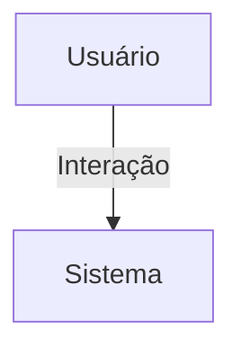

## 1. Visão Geral

<descrição curta>

## 2. Escopo
- **Inclui**:
- **Exclui**:

## 3. Requisitos Funcionais
| Código | Descrição | Prioridade | Critérios de Aceite |
|--------|-----------|-----------|---------------------|

## 4. Requisitos Não-Funcionais
| Código | Categoria | Descrição | Métrica/Meta |
|--------|-----------|-----------|--------------|

## 5. Fluxo de Usuário / Caso de Uso


### UC-01 – Descrição

## 6. Regras de Negócio

## 7. Modelo de Dados

## 8. Critérios de Aceite (Gherkin)
```gherkin
Feature: <nome>
```

## 9. Dependências / Integrações

## 10. Anexos e Referências
- Documento fonte: requisitos_dashboard_hubx.pdf

## 99. Conteúdo Importado (para revisão)

```
Requisitos do App Dashboard - Sistema Hubx
Objetivo
Oferecer visualizações dinâmicas e personalizadas de métricas, estatísticas e tendências para diferentes
tipos de usuários, com base no seu papel no sistema, podendo ser reutilizado e estendido por outros apps
(como nucleos, eventos etc).
Tipos de Usuários e Acesso
- root: acesso a totais globais por período (organizações, empresas, usuários, núcleos, eventos), com
análise de crescimento por mês, trimestre, semestre, ano e período customizado.
- admin: acesso a métricas da organização (usuários, núcleos, eventos, empresas), estatísticas e tendências
por período.
- coordenador: acesso a métricas dos núcleos e eventos que coordena, com estatísticas e crescimento por
período.
- nucleado: herda visão de associado (eventos que participou, núcleos que pertence).
- associado: visão parcial na página de perfil (eventos e núcleos).
- convidado: não tem acesso ao dashboard.
Reutilização e Extensibilidade
- App nucleos: métricas por núcleo e período.
- App eventos: métricas de evento por período.
- App accounts: dashboard parcial no perfil do associado.
Métricas e Filtros
Métricas principais: num_users, num_organizacoes, num_nucleos, num_empresas, num_eventos,
participações do usuário.
Filtros de período: mensal, trimestral, semestral, anual e intervalo customizado
(?inicio=YYYY-MM-DD&fim=YYYY-MM-DD).
Estatísticas e Tendências
- Variação percentual em relação ao período anterior.
- Gráficos de linha (tendência temporal).
- Gráficos de pizza ou barras (distribuição por tipo/status).
Redirecionamento de Dashboard
Redirecionamento automático baseado em tipo de usuário:
- ROOT -> dashboard:root

Requisitos do App Dashboard - Sistema Hubx
- ADMIN -> dashboard:admin
- COORDENADOR -> dashboard:coordenador
- ASSOCIADO/NUCLEADO -> perfil
- CONVIDADO -> página inicial
Requisitos Técnicos
- DashboardBaseView deve aceitar parâmetros: período, escopo, filtros.
- View estruturada para herança e reutilização por outros apps.
- get_metrics() parametrizável via kwargs ou request.GET.
```
