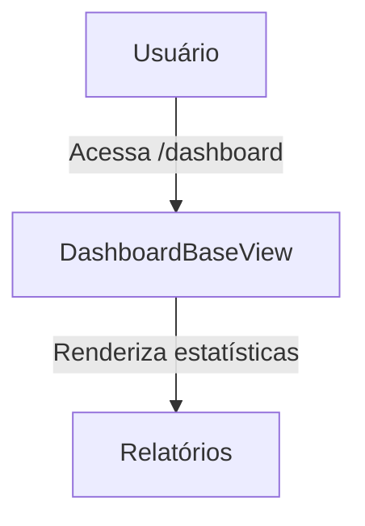

## 1. Visão Geral

Oferecer visualizações dinâmicas e personalizadas de métricas, estatísticas e tendências para diferentes tipos de usuários do sistema Hubx, podendo ser reutilizado e estendido por outros aplicativos.

## 2. Escopo
- **Inclui**  
  - Painéis de estatísticas conforme perfil do usuário.  
  - Extensibilidade para apps de Núcleos, Eventos e Contas.  
- **Exclui**  
  - Edição ou gerenciamento de dados através do dashboard.

## 3. Requisitos Funcionais

- **RF-01**  
  - Descrição: `DashboardBaseView` deve aceitar parâmetros: período, escopo e filtros.  
  - Prioridade: Alta  
  - Critérios de Aceite: Aceita `periodo`, `escopo` e filtros via `request.GET`.  

- **RF-02**  
  - Descrição: Função `get_metrics()` parametrizável via kwargs ou `request.GET`.  
  - Prioridade: Alta  
  - Critérios de Aceite: Métricas retornadas conforme parâmetros especificados.  

- **RF-03**  
  - Descrição: Calcular variação percentual de métricas em relação ao período anterior.  
  - Prioridade: Média  
  - Critérios de Aceite: Percentual calculado conforme fórmula definida.  

- **RF-04**  
  - Descrição: Redirecionamento inteligente conforme tipo de usuário (root, admin etc.).  
  - Prioridade: Alta  
  - Critérios de Aceite: Usuário redirecionado corretamente ao acessar `/dashboard`.  

## 4. Requisitos Não-Funcionais

- **RNF-01**  
  - Categoria: Desempenho  
  - Descrição: Tempo de resposta das views de dashboard  
  - Métrica/Meta: p95 ≤ 250 ms  

- **RNF-02**  
  - Categoria: Manutenibilidade  
  - Descrição: Código modular e estruturado para herança.  
  - Métrica/Meta: Cobertura ≥ 90 %  

## 5. Fluxo de Usuário / Caso de Uso

### UC-01 – Acesso ao Dashboard
1. Usuário faz login e acessa `/dashboard`.  
2. Sistema identifica perfil e redireciona à view apropriada.  
3. Dashboard é renderizado com métricas e opções de filtro.

## 6. Regras de Negócio
- Somente usuários autenticados podem acessar o dashboard.  
- Perfis e acessos:  
  - **root**: métricas globais.  
  - **admin**: métricas da organização.  
  - **coordenador**: métricas de núcleos/eventos que coordena.  
  - **associado/nucleado**: visão parcial conforme permissão.  
  - **convidado**: sem acesso.

## 7. Modelo de Dados
Reaproveita modelos existentes:  
- Usuário (`User`),  
- Organização (`Organization`),  
- Núcleo (`Nucleo`),  
- Evento (`Evento`).

## 8. Critérios de Aceite (Gherkin)
```gherkin
Feature: Acesso ao Dashboard
  Scenario: Usuário root acessa métricas globais
    Given usuário autenticado com perfil "root"
    When acessa "/dashboard"
    Then vê métricas globais e filtros disponíveis
```

## 9. Dependências / Integrações
- Serviços de métricas em `services/dashboard_metrics.py`.  
- URLs e views em `urls.py` e `views/dashboard.py`.

## 10. Anexos e Referências
- `requisitos_dashboard_hubx.pdf`  
- `estrutura_tecnica_dashboard.pdf`

## 99. Conteúdo Importado (para revisão)
```
<cole aqui o texto bruto extraído dos PDFs>
```
