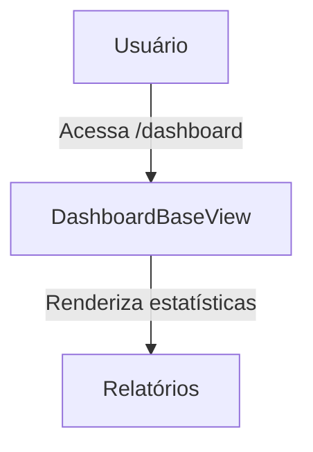
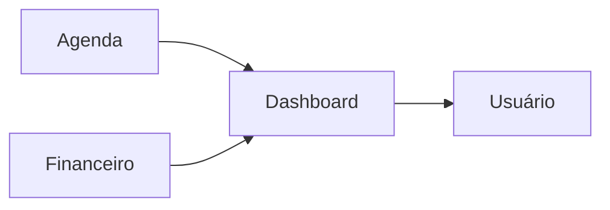

## 1. Visão Geral

Oferecer visualizações dinâmicas e personalizadas de métricas, estatísticas e tendências para diferentes tipos de usuários do sistema Hubx, podendo ser reutilizado e estendido por outros aplicativos.


## 2. Escopo


- **Inclui**  
  - Painéis de estatísticas conforme perfil do usuário.  
  - Extensibilidade para apps de Núcleos, Eventos e Contas.  
- **Exclui**  
  - Edição ou gerenciamento de dados através do dashboard.


## 3. Requisitos Funcionais

- **RF‑01**  
  - Descrição: `DashboardBaseView` deve aceitar parâmetros: período, escopo e filtros.  
  - Prioridade: Alta  
  - Critérios de Aceite: Aceita `periodo`, `escopo` e filtros via `request.GET`.  

- **RF‑02**  
  - Descrição: Função `get_metrics()` parametrizável via kwargs ou `request.GET`.  
  - Prioridade: Alta  
  - Critérios de Aceite: Métricas retornadas conforme parâmetros especificados.  

- **RF‑03**  
  - Descrição: Calcular variação percentual de métricas em relação ao período anterior.  
  - Prioridade: Média  
  - Critérios de Aceite: Percentual calculado conforme fórmula definida.  

- **RF‑04**
  - Descrição: Redirecionamento inteligente conforme tipo de usuário (root, admin etc.).
  - Prioridade: Alta
  - Critérios de Aceite: Usuário redirecionado corretamente ao acessar `/dashboard`.

- **RF‑05**
  - Descrição: Exibir métricas de inscrições confirmadas e lançamentos financeiros pendentes.
  - Prioridade: Média
  - Critérios de Aceite: Valores refletem dados da Agenda e do Financeiro.

- **RF‑06**
  - Descrição: Permitir que usuários admin/root criem múltiplos dashboards personalizáveis.
  - Prioridade: Média
  - Critérios de Aceite: Configurações serializadas em JSON com suporte a CRUD.

- **RF‑07**
  - Descrição: Integrar métricas de eventos e financeiras provenientes de Agenda e Financeiro.
  - Prioridade: Alta
  - Critérios de Aceite: Métricas respeitam escopo e permissões de acesso.

- **RF‑08**
  - Descrição: Disponibilizar atualizações em tempo real via WebSocket.
  - Prioridade: Média
  - Critérios de Aceite: Dashboards conectados recebem novas métricas sem recarregar a página.


## 4. Requisitos Não‑Funcionais

- **RNF‑01**  
  - Categoria: Desempenho  
  - Descrição: Tempo de resposta das views de dashboard  
  - Métrica/Meta: p95 ≤ 250 ms  

- **RNF‑02**  
  - Categoria: Manutenibilidade  
  - Descrição: Código modular e estruturado para herança.  
  - Métrica/Meta: Cobertura ≥ 90 %  


- **RNF‑03**: Todos os modelos deste app devem herdar de `TimeStampedModel` para timestamps automáticos (`created` e `modified`), garantindo consistência e evitando campos manuais.
- **RNF‑04**: Quando houver necessidade de exclusão lógica, os modelos devem implementar `SoftDeleteModel` (ou mixin equivalente), evitando remoções físicas e padronizando os campos `deleted` e `deleted_at`.

- **RNF‑05**
  - Categoria: Internacionalização
  - Descrição: Suporte a português e inglês por meio de arquivos de tradução `django.po`.
  - Métrica/Meta: Todas as strings renderizadas no dashboard devem utilizar `gettext`.

- **RNF‑06**
  - Categoria: Escalabilidade
  - Descrição: Atualizações em tempo real devem utilizar canais WebSocket dedicados.
  - Métrica/Meta: Impacto mínimo na latência (< 1 s) para distribuição de eventos.


## 5. Casos de Uso



### UC‑01 – Acesso ao Dashboard
1. Usuário faz login e acessa `/dashboard`.  
2. Sistema identifica perfil e redireciona à view apropriada.  
3. Dashboard é renderizado com métricas e opções de filtro.


## 6. Regras de Negócio


- Somente usuários autenticados podem acessar o dashboard.  
- Perfis e acessos:  
  - **root**: métricas globais.  
  - **admin**: métricas da organização.  
  - **coordenador**: métricas de núcleos/eventos que coordena.  
  - **associado/nucleado**: visão parcial conforme permissão.  
 - **convidado**: sem acesso.


## 7. Modelo de Dados


*Nota:* Todos os modelos herdam de `TimeStampedModel` (campos `created` e `modified`) e utilizam `SoftDeleteModel` para exclusão lógica quando necessário. Assim, campos de timestamp e exclusão lógica não são listados individualmente.
Reaproveita modelos existentes:  
- Usuário (`User`),  
- Organização (`Organization`),  
- Núcleo (`Nucleo`),  
- Evento (`Evento`).


## 8. Critérios de Aceite (Gherkin)


```gherkin
Feature: Acesso ao Dashboard
  Scenario: Usuário root acessa métricas globais
    Given usuário autenticado com perfil "root"
    When acessa "/dashboard"
    Then vê métricas globais e filtros disponíveis
```

### Fluxo de Dados Entre Módulos




## 9. Dependências / Integrações


- Serviços de métricas em `services/dashboard_metrics.py`.  
- URLs e views em `urls.py` e `views/dashboard.py`.


## 10. Requisitos Adicionais / Melhorias

### Requisitos Funcionais Adicionais
- **RF‑05** – Implementar função `get_variation(previous_value, current_value)` para calcular variação percentual: `(current_value − previous_value) / max(previous_value,1) * 100`.  
- **RF‑06** – Disponibilizar exportação de gráficos e métricas em PDF ou CSV para usuários autorizados.  
- **RF‑07** – Permitir que usuários salvem e compartilhem filtros e configurações de dashboards.  

### Requisitos Não‑Funcionais Adicionais
- **RNF‑05** – As consultas de métricas devem ser cacheadas com invalidação automática a cada 5 minutos.  
- **RNF‑06** – O componente de visualização deve seguir princípios de acessibilidade (WCAG 2.1).
