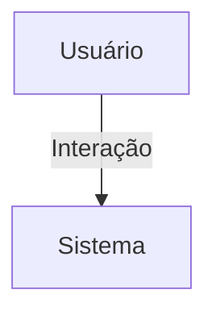

## 1. Visão Geral

<descrição curta>

## 2. Escopo
- **Inclui**:
- **Exclui**:

## 3. Requisitos Funcionais
| Código | Descrição | Prioridade | Critérios de Aceite |
|--------|-----------|-----------|---------------------|

## 4. Requisitos Não-Funcionais
| Código | Categoria | Descrição | Métrica/Meta |
|--------|-----------|-----------|--------------|

## 5. Fluxo de Usuário / Caso de Uso


### UC-01 – Descrição

## 6. Regras de Negócio

## 7. Modelo de Dados

## 8. Critérios de Aceite (Gherkin)
```gherkin
Feature: <nome>
```

## 9. Dependências / Integrações

## 10. Anexos e Referências
- Documento fonte: requisitos_app_forum_hubx.pdf

## 99. Conteúdo Importado (para revisão)

```
Requisitos do App Discussao - HubX
Objetivo
Oferecer um espaço organizado por categorias de discussão, com tópicos e respostas, voltado à troca de
conhecimento e comunicação interna entre membros de uma organização.
Estrutura de Dados
- Categoria: nome, descrição, organização
- Tópico: título, conteúdo, autor, categoria, organização
- Resposta: conteúdo, autor, tópico (herda organização do tópico)
Permissões por Tipo de Usuário
- Superadmin: Acesso bloqueado
- Associado: Visualiza categorias, cria tópicos e responde
- Coordenador: Acesso completo se também for gerente
- Admin: Acesso completo
Funcionalidades
- Categorias:
- Grid visual com descrição
- Botão Gerenciar para tipos autorizados
- Gerenciamento de Categorias:
- Acesso exclusivo de gerentes
- Criar, editar e remover
- Tópicos:
- Criação com formulário visual limpo
- Listagem com autor e data
- Respostas:
- Inserção de respostas em tópicos
- Sem edição/removal por padrão
Aspectos Técnicos
- Todas as views usam LoginRequiredMixin e NoSuperadminMixin
- Gerenciamento restrito por GerenteRequiredMixin
- Templates responsivos com classes modernas
- Estrutura de URLs bem definida e intuitiva
Sugestões Futuras
- Permitir autores editarem/removerem tópicos e respostas
- Marcar tópicos como resolvido
- Sistema de votação (upvote)
- Busca e filtro por autor
- Adição de tags por tópico
- Estatísticas de participação
```
