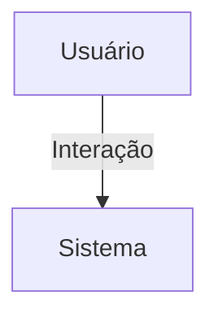

## 1. Visão Geral

<descrição curta>

## 2. Escopo
- **Inclui**:
- **Exclui**:

## 3. Requisitos Funcionais
| Código | Descrição | Prioridade | Critérios de Aceite |
|--------|-----------|-----------|---------------------|

## 4. Requisitos Não-Funcionais
| Código | Categoria | Descrição | Métrica/Meta |
|--------|-----------|-----------|--------------|

## 5. Fluxo de Usuário / Caso de Uso


### UC-01 – Descrição

## 6. Regras de Negócio

## 7. Modelo de Dados

## 8. Critérios de Aceite (Gherkin)
```gherkin
Feature: <nome>
```

## 9. Dependências / Integrações

## 10. Anexos e Referências
- Documento fonte: Requisitos_Empresas_Hubx.pdf

## 99. Conteúdo Importado (para revisão)

```
Requisitos do Domínio: Empresas - Sistema Hubx
1. MODELO EMPRESA
Herança:
- TimeStampedModel
Campos:
- usuario: ForeignKey(User, on_delete=CASCADE, related_name='empresas')
- organizacao: ForeignKey(Organizacao, on_delete=CASCADE, related_name='empresas')
- nome: CharField(max_length=255)
- cnpj: CharField(max_length=18, unique=True)
- tipo: CharField(max_length=100)
- municipio: CharField(max_length=100)
- estado: CharField(max_length=2)
- logo: ImageField(upload_to='empresas/logos/', blank=True, null=True)
- descricao: TextField(blank=True)
- contato: CharField(max_length=255, blank=True)
- palavras_chave: CharField(max_length=255, blank=True)
- tags: ManyToManyField(Tag, related_name='empresas', blank=True)
2. MODELO TAG
Herança:
- TimeStampedModel
Campos:
- nome: CharField(max_length=50, unique=True)
- categoria: CharField (choices: 'prod'=Produto, 'serv'=Serviço)
3. REGRAS

- O campo cnpj deve ser único em todo o sistema
- A empresa deve estar vinculada a uma organização obrigatoriamente
- O campo usuario define o responsável pelo cadastro da empresa
- As tags são opcionais, mas recomendadas
- O campo palavras_chave serve para filtros e busca textual
4. RELAÇÃO COM USUÁRIOS
- Usuários podem cadastrar empresas vinculadas à sua organização
- Campo usuario define a autoria da empresa
- As permissões aplicadas nas views devem respeitar a organização
5. PERMISSÕES
- Root: acesso a todas as empresas
- Admin: CRUD de empresas da própria organização
- Usuários padrão: podem gerenciar as empresas que criaram
6. CRITÉRIOS DE ACEITAÇÃO
- TimeStampedModel garante created e updated
- Validação de unicidade de CNPJ
- As permissões respeitam a organização
- Testes devem validar:
- filtros por organização
- integridade dos campos obrigatórios
- uso de tags e palavras-chave
- controle de autoria e escopo
```
