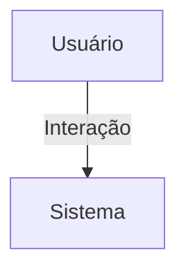

## 1. Visão Geral

<descrição curta>

## 2. Escopo
- **Inclui**:
- **Exclui**:

## 3. Requisitos Funcionais
| Código | Descrição | Prioridade | Critérios de Aceite |
|--------|-----------|-----------|---------------------|

## 4. Requisitos Não-Funcionais
| Código | Categoria | Descrição | Métrica/Meta |
|--------|-----------|-----------|--------------|

## 5. Fluxo de Usuário / Caso de Uso


### UC-01 – Descrição

## 6. Regras de Negócio

## 7. Modelo de Dados

## 8. Critérios de Aceite (Gherkin)
```gherkin
Feature: <nome>
```

## 9. Dependências / Integrações

## 10. Anexos e Referências
- Documento fonte: estrutura_tecnica_dashboard.pdf

## 99. Conteúdo Importado (para revisão)

```
Estrutura Técnica - App Dashboard
Estrutura de Arquivos Sugerida
dashboard/
views/
base.py
root.py
admin.py
coordenador.py
associado.py
templates/
dashboard/
root.html
admin.html
coordenador.html
associado.html
urls.py
filters.py
services.py
__init__.py
apps.py
filters.py
Função get_period_range(periodo, inicio, fim):
- Calcula intervalo de datas com base no período informado.
- Suporta: mensal, trimestral, semestral, anual e intervalo customizado.
services.py
Função calcular_crescimento(queryset, inicio, fim, campo_data):
- Conta registros atuais no período e compara com anterior.
- Retorna total e crescimento percentual.
views/base.py
Classe DashboardBaseView(TemplateView):
- Oferece métodos utilitários como get_periodo() para obter intervalo.
- Prepara contexto padrão com inicio/fim do período.
views/root.py
Classe RootDashboardView(DashboardBaseView):
- Exibe métricas globais (usuários, organizações, empresas, núcleos, eventos).
- Usa calcular_crescimento para análise por período.
urls.py

Estrutura Técnica - App Dashboard
Mapeamento de URLs:
- /root/ -> RootDashboardView
- /admin/ -> AdminDashboardView
- /coordenador/ -> CoordenadorDashboardView
- /associado/ -> AssociadoDashboardView
Redirecionamento Inteligente
Função dashboard_redirect(request):
- Redireciona usuário autenticado com base no tipo:
ROOT -> dashboard:root
ADMIN -> dashboard:admin
COORDENADOR -> dashboard:coordenador
ASSOCIADO/NUCLEADO -> dashboard:associado
CONVIDADO -> página_inicial
```
