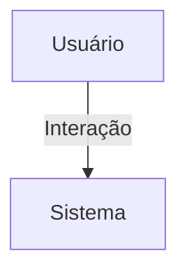

## 1. Visão Geral

<descrição curta>

## 2. Escopo
- **Inclui**:
- **Exclui**:

## 3. Requisitos Funcionais
| Código | Descrição | Prioridade | Critérios de Aceite |
|--------|-----------|-----------|---------------------|

## 4. Requisitos Não-Funcionais
| Código | Categoria | Descrição | Métrica/Meta |
|--------|-----------|-----------|--------------|

## 5. Fluxo de Usuário / Caso de Uso


### UC-01 – Descrição

## 6. Regras de Negócio

## 7. Modelo de Dados

## 8. Critérios de Aceite (Gherkin)
```gherkin
Feature: <nome>
```

## 9. Dependências / Integrações

## 10. Anexos e Referências
- Documento fonte: Requisitos_BriefingEvento_Hubx.pdf

## 99. Conteúdo Importado (para revisão)

```
Requisitos do Modelo: Briefing de Evento - Sistema Hubx (Com Recusa Final)
1. MODELO BRIEFING_EVENTO
Herança:
- TimeStampedModel (obrigatória para auditoria e estatísticas futuras)
Relacionamento:
- OneToOneField com Evento
Campos principais:
1. Controle de fluxo
- status: CharField (choices):
* rascunho
* aguardando_orcamento
* aguardando_aprovacao
* revisar_orcamento
* aprovado
* recusado
- coordenadora_aprovou: BooleanField(null=True)
- orcamento_enviado_em: DateTimeField(null=True)
- prazo_limite_resposta: DateTimeField(null=True)
- observacoes_resposta: TextField(blank=True)
- recusado_por: ForeignKey(User, null=True, blank=True, on_delete=SET_NULL)
- recusado_em: DateTimeField(null=True, blank=True)
- motivo_recusa: TextField(blank=True)
2. Campos do briefing (mesmos já existentes anteriormente)
- local_reservado: BooleanField
- tem_alimentacao, tipo_alimentacao, observacoes_cardapio

- tem_atracao_especial, tipo_atracao, contrapartida_palestrante, link_profissional
- precisa_fotografia, tipo_profissional, indicacao_profissional
- detalhes_sonorizacao, precisa_decoracao, detalhes_decoracao
- materiais_necessarios, layout_mesas
- distribuir_brindes, tipo_brindes
- divulgacao_conteudo, materiais_divulgacao, elementos_visuais, referencias_visuais
- realizadores_apoiadores, data_limite_confirmacao, patrocinadores_info, link_formulario_patrocinadores
3. REGRAS E COMPORTAMENTO
- Briefings passam por estados controlados com base no fluxo:
coordenadora envia > admin orça > coordenadora aprova/questiona/recusa
- Recusa encerra o ciclo: status = "recusado"
- Notificações devem ser emitidas se estiver "aguardando_aprovacao" e prazo expirando
4. CRITÉRIOS DE ACEITAÇÃO
- Deve ser possível rastrear quem recusou e quando
- Apenas usuários com permissão podem marcar como recusado
- Campos de controle substituem campos redundantes (ex: criado_em)
- Testes cobrem:
- transições de status
- prazos e notificação
- inclusão de motivo de recusa
```
