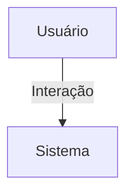

## 1. Visão Geral

<descrição curta>

## 2. Escopo
- **Inclui**:
- **Exclui**:

## 3. Requisitos Funcionais
| Código | Descrição | Prioridade | Critérios de Aceite |
|--------|-----------|-----------|---------------------|

## 4. Requisitos Não-Funcionais
| Código | Categoria | Descrição | Métrica/Meta |
|--------|-----------|-----------|--------------|

## 5. Fluxo de Usuário / Caso de Uso


### UC-01 – Descrição

## 6. Regras de Negócio

## 7. Modelo de Dados

## 8. Critérios de Aceite (Gherkin)
```gherkin
Feature: <nome>
```

## 9. Dependências / Integrações

## 10. Anexos e Referências
- Documento fonte: Requisitos_Eventos_Hubx.pdf

## 99. Conteúdo Importado (para revisão)

```
Requisitos_Eventos_Hubx_Final
Requisitos do Domínio: Eventos - Sistema Hubx (Versão Atualizada)
1. MODELO EVENTO
Herança:
- TimeStampedModel
Campos principais:
- titulo, descricao, data_inicio, data_fim, endereco, cidade, estado, cep
- coordenador: FK para User
- organizacao: FK obrigatória
- nucleo: FK opcional
- status: IntegerField (0=ativo, 1=concluído, 2=cancelado)
- publico_alvo: IntegerField (0=público, 1=nucleados, 2=associados)
- numero_convidados, numero_presentes
- valor_ingresso, orcamento, cronograma, informacoes_adicionais
- contato_nome, contato_email, contato_whatsapp
- avatar, cover
2. REGRAS
- Escopo definido por organização ou núcleo
- Apenas inscritos avaliam após término
- Avaliação bloqueada antes do término
- número_presentes não pode exceder número_convidados
3. CRITÉRIOS DE ACEITAÇÃO
- Todos os campos auditáveis via TimeStampedModel
- Testes cobrem: status, escopo, visibilidade, avaliação
```
