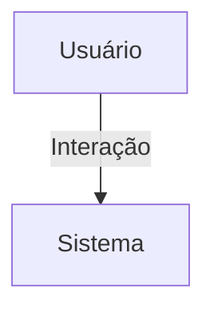

## 1. Visão Geral

<descrição curta>

## 2. Escopo
- **Inclui**:
- **Exclui**:

## 3. Requisitos Funcionais
| Código | Descrição | Prioridade | Critérios de Aceite |
|--------|-----------|-----------|---------------------|

## 4. Requisitos Não-Funcionais
| Código | Categoria | Descrição | Métrica/Meta |
|--------|-----------|-----------|--------------|

## 5. Fluxo de Usuário / Caso de Uso


### UC-01 – Descrição

## 6. Regras de Negócio

## 7. Modelo de Dados

## 8. Critérios de Aceite (Gherkin)
```gherkin
Feature: <nome>
```

## 9. Dependências / Integrações

## 10. Anexos e Referências
- Documento fonte: Requisitos_InscricaoEvento_Hubx.pdf

## 99. Conteúdo Importado (para revisão)

```
Requisitos_InscricaoEvento_Hubx_Atualizado
Requisitos do Modelo: Inscrição em Evento - Sistema Hubx (Atualizado)
1. MODELO INSCRICAO_EVENTO
Herança:
- TimeStampedModel
Campos:
- user, evento (FKs)
- presente: BooleanField
- avaliacao: PositiveSmallIntegerField (1-5)
- valor_pago: DecimalField
- observacao: TextField (opcional)
Regras:
- Inscrição única por evento
- Avaliação só permitida após término e se status = concluído
2. CRITÉRIOS DE ACEITAÇÃO
- Sem campo data_inscricao (usa created)
- Testes cobrem: presença, avaliação, valor
```
