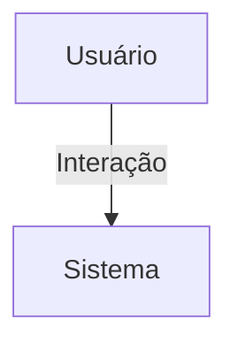

## 1. Visão Geral

<descrição curta>

## 2. Escopo
- **Inclui**:
- **Exclui**:

## 3. Requisitos Funcionais
| Código | Descrição | Prioridade | Critérios de Aceite |
|--------|-----------|-----------|---------------------|

## 4. Requisitos Não-Funcionais
| Código | Categoria | Descrição | Métrica/Meta |
|--------|-----------|-----------|--------------|

## 5. Fluxo de Usuário / Caso de Uso


### UC-01 – Descrição

## 6. Regras de Negócio

## 7. Modelo de Dados

## 8. Critérios de Aceite (Gherkin)
```gherkin
Feature: <nome>
```

## 9. Dependências / Integrações

## 10. Anexos e Referências
- Documento fonte: Requisitos_MaterialDivulgacaoEvento_Hubx.pdf

## 99. Conteúdo Importado (para revisão)

```
Requisitos_MaterialDivulgacaoEvento_Hubx_Atualizado
Requisitos do Modelo: Material de Divulgação do Evento - Sistema Hubx (Atualizado)
1. MODELO MATERIAL_DIVULGACAO_EVENTO
Herança:
- TimeStampedModel
Relacionamento:
- FK com Evento
Campos:
- arquivo (imagem, vídeo, PDF)
- descricao, tags (para classificação)
2. CRITÉRIOS DE ACEITAÇÃO
- Arquivos auditáveis
- Suporte a múltiplos formatos
- Testes cobrem vínculo e metadados
```
