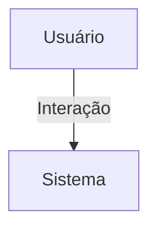

## 1. Visão Geral

<descrição curta>

## 2. Escopo
- **Inclui**:
- **Exclui**:

## 3. Requisitos Funcionais
| Código | Descrição | Prioridade | Critérios de Aceite |
|--------|-----------|-----------|---------------------|

## 4. Requisitos Não-Funcionais
| Código | Categoria | Descrição | Métrica/Meta |
|--------|-----------|-----------|--------------|

## 5. Fluxo de Usuário / Caso de Uso


### UC-01 – Descrição

## 6. Regras de Negócio

## 7. Modelo de Dados

## 8. Critérios de Aceite (Gherkin)
```gherkin
Feature: <nome>
```

## 9. Dependências / Integrações

## 10. Anexos e Referências
- Documento fonte: Requisitos_ParceriaEvento_Hubx.pdf

## 99. Conteúdo Importado (para revisão)

```
Requisitos_ParceriaEvento_Hubx_Atualizado
Requisitos do Modelo: Parceria e Patrocínio de Evento - Sistema Hubx (Atualizado)
1. MODELO PARCERIA_EVENTO
Herança:
- TimeStampedModel
Relacionamentos:
- evento: FK obrigatória
- nucleo: FK opcional
Campos:
- empresa_razao_social, cnpj, endereco_empresa
- representante_legal_nome, representante_legal_cpf, representante_legal_email
- nome_solicitante, cpf_solicitante (opcionais)
- whatsapp_contato
- tipo_parceria: CharField (ex: patrocínio, mentoria, mantenedor)
2. CRITÉRIOS DE ACEITAÇÃO
- Eliminar campos nome_evento e nome_nucleo (usar FKs)
- Testes cobrem obrigatoriedade e integridade de dados
```
