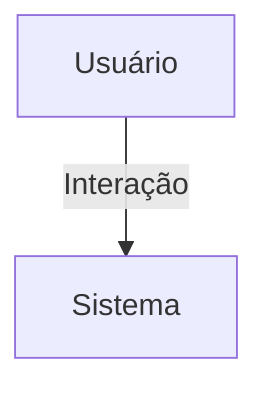

## 1. Visão Geral

<descrição curta>

## 2. Escopo
- **Inclui**:
- **Exclui**:

## 3. Requisitos Funcionais
| Código | Descrição | Prioridade | Critérios de Aceite |
|--------|-----------|-----------|---------------------|

## 4. Requisitos Não-Funcionais
| Código | Categoria | Descrição | Métrica/Meta |
|--------|-----------|-----------|--------------|

## 5. Fluxo de Usuário / Caso de Uso


### UC-01 – Descrição

## 6. Regras de Negócio

## 7. Modelo de Dados

## 8. Critérios de Aceite (Gherkin)
```gherkin
Feature: <nome>
```

## 9. Dependências / Integrações

## 10. Anexos e Referências
- Documento fonte: explicacao_modelo_chat.pdf

## 99. Conteúdo Importado (para revisão)

```
Explicação Técnica do Modelo: chat.models
Classe Mensagem
Modelo principal que representa uma mensagem enviada por um usuário.
Campos principais:
- remetente: Usuário que envia a mensagem.
- destinatario: Usuário que recebe a mensagem (para chats privados). Pode ser nulo em chats coletivos.
- nucleo: Relaciona a mensagem a um núcleo específico (opcional).
- evento: Relaciona a mensagem a um evento (opcional).
- organizacao: Relaciona a mensagem a uma organização (opcional).
- tipo: Define o tipo de conteúdo ('text', 'image', 'video', 'file').
- conteudo: O conteúdo textual ou URL do arquivo.
Regras:
- Apenas um dos escopos deve ser definido (nucleo, evento ou organizacao).
- Usado tanto para chats privados quanto coletivos, dependendo dos campos preenchidos.
Classe Notificacao
Modelo que representa uma notificação de mensagem para um usuário.
Campos principais:
- usuario: O usuário notificado.
- remetente: Quem enviou a mensagem.
- mensagem: Referência à mensagem recebida.
- lida: Booleano indicando se a notificação foi visualizada.
Usado para exibir alertas de novas mensagens em dashboards ou menus de notificações.
Herança de TimeStampedModel
Ambas as classes herdam de TimeStampedModel (modelo base), o que adiciona campos como:
- created_at: Data/hora de criação da instância.
- updated_at: Data/hora da última modificação.
Design e Flexibilidade
O modelo foi desenhado para suportar múltiplos contextos de chat com reutilização máxima:
- Chat privado (via remetente + destinatario)
- Chat de núcleo (via campo nucleo)
- Chat de evento (via campo evento)
- Chat da organização (via campo organizacao)
Com isso, o mesmo modelo atende todos os escopos do sistema HubX com validações baseadas no contexto.
```
