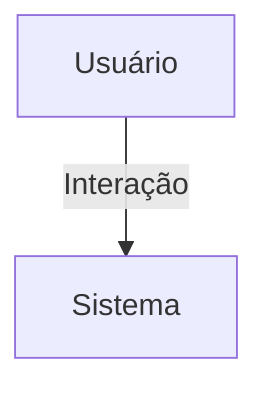

## 1. Visão Geral

<descrição curta>

## 2. Escopo
- **Inclui**:
- **Exclui**:

## 3. Requisitos Funcionais
| Código | Descrição | Prioridade | Critérios de Aceite |
|--------|-----------|-----------|---------------------|

## 4. Requisitos Não-Funcionais
| Código | Categoria | Descrição | Métrica/Meta |
|--------|-----------|-----------|--------------|

## 5. Fluxo de Usuário / Caso de Uso


### UC-01 – Descrição

## 6. Regras de Negócio

## 7. Modelo de Dados

## 8. Critérios de Aceite (Gherkin)
```gherkin
Feature: <nome>
```

## 9. Dependências / Integrações

## 10. Anexos e Referências
- Documento fonte: Requisitos_Feed_Hubx_Atualizado.pdf

## 99. Conteúdo Importado (para revisão)

```
Requisitos do Domínio: Feed - Sistema Hubx (Atualizado)
1. MODELO POST
Herança:
- TimeStampedModel
Campos:
- autor: ForeignKey(User)
- organizacao: ForeignKey(Organizacao)
- tipo_feed: CharField (choices: global, usuario, nucleo, evento)
- conteudo: TextField
- image: ImageField (upload_to='uploads/', blank=True, null=True)
- pdf: FileField (upload_to='uploads/', blank=True, null=True)
- nucleo: ForeignKey(Nucleo, null=True, blank=True)
- evento: ForeignKey(Evento, null=True, blank=True)
Choices de tipo_feed:
- global: Feed da organização
- usuario: Mural do usuário
- nucleo: Feed do núcleo
- evento: Feed do evento
2. REGRAS
- Se tipo_feed = 'nucleo', campo nucleo é obrigatório
- Se tipo_feed = 'evento', campo evento é obrigatório
- Campo organizacao é obrigatório em todos os casos
- Posts podem conter texto e/ou mídia (imagem ou PDF)
- A visibilidade e listagem do post dependem de tipo_feed e escopo associado
3. RELAÇÃO COM OUTROS APPS

- feed.views.FeedGlobalView -> tipo_feed = 'global'
- accounts.views.MuralUsuarioView -> tipo_feed = 'usuario', autor = request.user
- nucleos.views.FeedNucleoView -> tipo_feed = 'nucleo', nucleo = x
- eventos.views.FeedEventoView -> tipo_feed = 'evento', evento = x
4. PERMISSÕES
- Root: acesso completo
- Admin: acesso à organização
- Coordenador: mural, núcleos vinculados
- Associado: mural próprio, feed global, núcleos próprios
- Convidado: feed global (público)
5. CRITÉRIOS DE ACEITAÇÃO
- Filtros por tipo_feed e organização aplicados
- Upload de arquivos validado
- Testes devem validar:
- permissão por escopo
- integridade de dados
- visibilidade e ordenação
```
