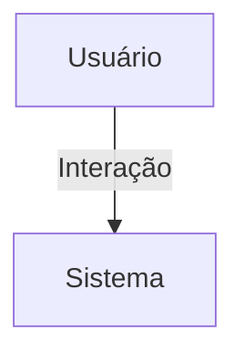

## 1. Visão Geral

<descrição curta>

## 2. Escopo
- **Inclui**:
- **Exclui**:

## 3. Requisitos Funcionais
| Código | Descrição | Prioridade | Critérios de Aceite |
|--------|-----------|-----------|---------------------|

## 4. Requisitos Não-Funcionais
| Código | Categoria | Descrição | Métrica/Meta |
|--------|-----------|-----------|--------------|

## 5. Fluxo de Usuário / Caso de Uso


### UC-01 – Descrição

## 6. Regras de Negócio

## 7. Modelo de Dados

## 8. Critérios de Aceite (Gherkin)
```gherkin
Feature: <nome>
```

## 9. Dependências / Integrações

## 10. Anexos e Referências
- Documento fonte: Requisitos_Nucleos_Hubx.pdf

## 99. Conteúdo Importado (para revisão)

```
Requisitos do Domínio: Núcleos - Sistema Hubx (Atualizado com Avatar e Capa)
1. MODELO NUCLEO
Herança:
- TimeStampedModel
Campos:
- nome: CharField(max_length=100)
- descricao: TextField(blank=True)
- avatar: ImageField(upload_to='nucleos/avatars/', null=True, blank=True)
- cover: ImageField(upload_to='nucleos/capas/', null=True, blank=True)
- organizacao: ForeignKey('Organizacao', on_delete=CASCADE, related_name='nucleos')
2. MODELO INTERMEDIÁRIO: ParticipacaoNucleo
- user: ForeignKey(User, on_delete=CASCADE)
- nucleo: ForeignKey(Nucleo, on_delete=CASCADE)
- is_coordenador: BooleanField(default=False)
- unique_together = ('user', 'nucleo')
3. RELAÇÃO COM USUÁRIOS
- User.nucleos: ManyToMany via ParticipacaoNucleo
- Um usuário pode estar em múltiplos núcleos
- Participação válida apenas se user.organizacao == nucleo.organizacao
- Todo participante de núcleo deve ser is_associado = True
4. PERMISSÕES
- Root: acesso total

- Admin: CRUD de núcleos e membros da sua organização
- Coordenador: visualiza e gerencia conteúdos apenas dos núcleos que coordena
- Nucleado: leitura apenas
- Associado/Convidado: sem acesso
5. CASOS DE USO
- Listar núcleos por organização ou por usuário
- Visualizar membros e coordenadores de um núcleo
- Adicionar/remover membros (somente admin)
- Upload do avatar e da capa do núcleo
- Avatar e cover exibidos em páginas de detalhe e espaços visuais do núcleo
6. CRITÉRIOS DE ACEITAÇÃO
- Avatar e cover são campos opcionais
- Upload de imagem tratado por media/ e validado no backend
- Participação por meio da tabela intermediária
- Escopo organizacional validado
- Testes automatizados:
- múltiplos vínculos
- permissões por papel
- upload e exibição de avatar e cover
```
