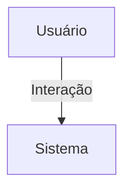

## 1. Visão Geral

<descrição curta>

## 2. Escopo
- **Inclui**:
- **Exclui**:

## 3. Requisitos Funcionais
| Código | Descrição | Prioridade | Critérios de Aceite |
|--------|-----------|-----------|---------------------|

## 4. Requisitos Não-Funcionais
| Código | Categoria | Descrição | Métrica/Meta |
|--------|-----------|-----------|--------------|

## 5. Fluxo de Usuário / Caso de Uso


### UC-01 – Descrição

## 6. Regras de Negócio

## 7. Modelo de Dados

## 8. Critérios de Aceite (Gherkin)
```gherkin
Feature: <nome>
```

## 9. Dependências / Integrações

## 10. Anexos e Referências
- Documento fonte: Requisitos_Organizacoes_Hubx_Atualizado.pdf

## 99. Conteúdo Importado (para revisão)

```
Requisitos do Domínio: Organizações - Sistema Hubx (Atualizado com Avatar e Capa)
1. MODELO ORGANIZACAO
Herança:
- TimeStampedModel
Campos:
- nome: CharField(max_length=100)
- slug: SlugField(unique=True)
- descricao: TextField(blank=True)
- avatar: ImageField(upload_to='organizacoes/avatars/', blank=True, null=True)
- cover: ImageField(upload_to='organizacoes/capas/', blank=True, null=True)
- created_at / updated_at: herdados de TimeStampedModel
2. REGRAS
- slug deve ser único
- avatar e cover são imagens opcionais
- avatar representa visualmente a organização
- cover pode ser usada como capa em páginas institucionais ou de navegação
- Usuários, núcleos e entidades relacionadas devem estar vinculadas a uma organização
3. RELAÇÃO COM USUÁRIOS
- Campo: organizacao = ForeignKey(Organizacao, on_delete=PROTECT)
- Apenas root pode ter organizacao=None
- Todos os outros usuários devem obrigatoriamente pertencer a uma organização
4. ENTIDADES VINCULADAS À ORGANIZAÇÃO

Todas devem conter: organizacao = ForeignKey(Organizacao, on_delete=CASCADE)
- User
- Nucleo
- Evento
- Empresa
- Postagem
- CategoriaForum
- TopicoForum
- Outros módulos (ex: chat, tokens, etc.)
5. PERMISSÕES
- Root: CRUD completo de organizações
- Admin: pode visualizar sua organização, mas não editar
- Outros perfis: não têm acesso direto ao modelo Organizacao
6. CRITÉRIOS DE ACEITAÇÃO
- Avatar e cover visíveis em painéis, cabeçalhos e listagens
- Filtros de organização aplicados a todas as views protegidas
- Viewsets e serializers devem incluir os campos visuais
- Testes automatizados devem validar:
- Escopo organizacional
- Permissões por tipo de usuário
- Upload e exibição do avatar e da cover
```
