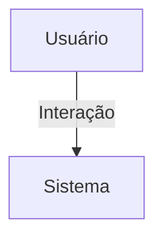

## 1. Visão Geral

<descrição curta>

## 2. Escopo
- **Inclui**:
- **Exclui**:

## 3. Requisitos Funcionais
| Código | Descrição | Prioridade | Critérios de Aceite |
|--------|-----------|-----------|---------------------|

## 4. Requisitos Não-Funcionais
| Código | Categoria | Descrição | Métrica/Meta |
|--------|-----------|-----------|--------------|

## 5. Fluxo de Usuário / Caso de Uso


### UC-01 – Descrição

## 6. Regras de Negócio

## 7. Modelo de Dados

## 8. Critérios de Aceite (Gherkin)
```gherkin
Feature: <nome>
```

## 9. Dependências / Integrações

## 10. Anexos e Referências
- Documento fonte: Requisitos_Tokens_Hubx.pdf

## 99. Conteúdo Importado (para revisão)

```
Requisitos do Domínio: Tokens de Acesso - Sistema Hubx (Hierarquia Atualizada)
1. MODELO TOKEN_ACESSO
Herança:
- TimeStampedModel
Campos:
- codigo: CharField(max_length=64, unique=True, editable=False)
- tipo_destino: CharField (choices: admin, associado, nucleado, coordenador, convidado)
- estado: CharField (choices: novo, usado, expirado)
- data_expiracao: DateTimeField
- gerado_por: ForeignKey(User)
- usuario: ForeignKey(User, null=True, blank=True)
- organizacao: ForeignKey(Organizacao)
- nucleos: ManyToManyField(Nucleo, blank=True)
2. ENUM TIPO_DESTINO
- admin
- associado
- nucleado (associado com núcleo)
- coordenador (associado com is_coordenador=True)
- convidado
3. PERMISSÕES PARA GERAÇÃO
- Root -> pode gerar token para: admin
- Admin -> pode gerar token para: associado, nucleado, coordenador
- Coordenador -> pode gerar token para: convidado
- Nucleado, Associado, Convidado -> não podem gerar tokens

4. REGRAS
- O token pode ser usado somente se:
- estado == novo
- data_expiracao > agora
- Ao ser utilizado:
- estado = usado
- usuario recebe vínculo com organizacao
- se tipo = nucleado ou coordenador -> vincular a núcleo(s)
- se tipo = coordenador -> is_coordenador = True
5. CRITÉRIOS DE ACEITAÇÃO
- Geração de codigo único e seguro (ex: uuid4().hex ou secrets.token_urlsafe)
- Geração restrita conforme tipo de quem cria (gerado_por)
- Token nunca reutilizável
- Escopo de organização obrigatório
- Testes devem validar:
- fluxo de uso
- associação automática
- validação de tipo e permissões de criação
- restrição por data de expiração
```
