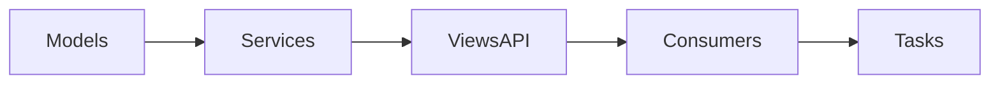

# Chat API

Módulo responsável pela comunicação em tempo real da plataforma. Os
recursos são expostos via REST e WebSocket e dependem de Redis,
Celery e Django Channels.

## Entidades

Todos os modelos utilizam `TimeStampedModel`, expondo os campos
`created` e `modified`. Quando necessário, a exclusão lógica é feita
com `SoftDeleteModel`, que adiciona `deleted` e `deleted_at`. Registros
removidos podem ser acessados via `Model.all_objects` e restaurados
definindo `deleted=False` e `deleted_at=None`.

- **ChatChannel** – canal de conversa associado a um contexto (núcleo,
  evento, organização ou privado). Possui exclusão lógica.
- **ChatParticipant** – relação de usuários com o canal, indicando
  proprietários e administradores.
- **ChatMessage** – mensagens enviadas no canal, com suporte a texto,
  arquivos e reações. Possui exclusão lógica e campos de moderação
  como `hidden_at` e `pinned_at`.
- **RelatorioChatExport** – registro de solicitações de exportação de
  histórico.

## Fluxo de camadas



## API REST

Endpoints REST para gerenciamento de canais e mensagens. Requer
autenticação via token JWT ou sessão.

## Exemplo de criação de canal

```http
POST /api/chat/channels/
Content-Type: application/json

{
  "contexto_tipo": "privado",
  "titulo": "Bate-papo"
}
```

## Listar mensagens de um canal

```http
GET /api/chat/channels/<id>/messages/
Authorization: Bearer <token>
```

Parâmetros opcionais:

- `desde=<ISO8601>` – mensagens a partir de uma data/hora.
- `ate=<ISO8601>` – mensagens até uma data/hora.

### Exportar histórico

```http
GET /api/chat/channels/<id>/export/?formato=csv
```

A chamada cria um `RelatorioChatExport` e, após processamento assíncrono,
disponibiliza um arquivo JSON ou CSV com as mensagens visíveis.

## WebSocket

Conexão:

```
ws://<host>/ws/chat/<channel_id>/
```

Após conectar, envie objetos JSON com `tipo` e `conteudo` para publicar
mensagens. O servidor transmite eventos de novos participantes,
reações, pins e moderação para todos os conectados.

## Permissões e papéis

- **Participante** – pode ler e enviar mensagens.
- **Admin** – gerencia metadados e participantes do canal.
- **Moderador** – aprova ou remove mensagens sinalizadas.

## Configuração

- Defina `ASGI_APPLICATION=Hubx.asgi.application` e `REDIS_URL` para
  habilitar o Channels.
- Execute o worker Celery: `celery -A Hubx worker -l info`.
- Variáveis de notificação e demais integrações são lidas de
  `settings` (ver exemplos em `start_server.py`).

## Exportação de histórico

Arquivos JSON possuem uma lista de objetos com `id`, `remetente`,
`tipo`, `conteudo` e `created`. No formato CSV, o cabeçalho segue a
mesma estrutura. Mensagens ocultas por moderação são ignoradas.

## Janela de chat flutuante

O módulo expõe uma interface de conversa em janela flutuante.
Para utilizá‑la, inclua o container com `id="chat-float-container"`
e um link com `id="chat-link"` na página. O script `static/js/chat_modal.js`
carrega a lista de usuários e as conversas via requisições assíncronas.
Usuários não autenticados são redirecionados para a página de login.
## Busca e histórico

- O template `conversation_detail.html` fornece um formulário com campo de busca, filtros de data e tipo de mensagem. Os resultados são carregados via `fetch` no endpoint `/api/chat/channels/<id>/messages/search/` e exibidos abaixo do campo em lista paginada.
- O script `static/chat/js/chat_socket.js` implementa scroll infinito consultando `/messages/history?before=<id>` para carregar mensagens anteriores. O endpoint retorna lotes de 20 mensagens ordenadas decrescentemente e informa se há mais dados.

## Acessibilidade

Cada mensagem renderizada em `partials/message.html` inclui um botão de reação com menu acessível via teclado e atributos ARIA. As reações existentes ficam dentro de `<ul class="reactions">`, permitindo que o JavaScript atualize contagens em tempo real.
