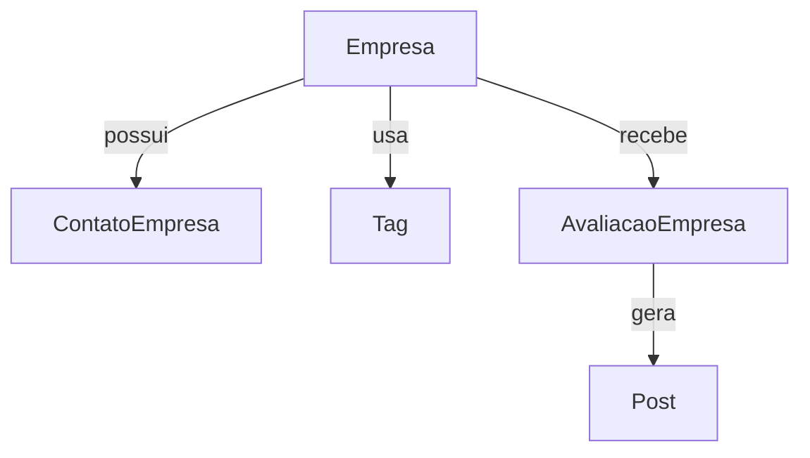

# Empresas

Módulo responsável pelo cadastro e gerenciamento de empresas. Todos os
modelos utilizam os mixins `TimeStampedModel` e `SoftDeleteModel`,
fornecendo campos padronizados de criação/atualização e exclusão lógica.

## Rotas principais

- `/empresas/` – listagem com filtros por nome, município, estado, tags e busca textual (`q`). Administradores podem visualizar registros excluídos passando `?mostrar_excluidas=1`.
- `/empresas/nova/` – criação.
- `/empresas/<id>/editar/` – edição.
- `/empresas/<id>/` – detalhes da empresa com avaliações e ações.
- `/empresas/<id>/historico/` – histórico de alterações.

## Filtros de busca

Exemplos:

```
/empresas/?nome=Alpha&municipio=Florianópolis
/empresas/?tags=1&tags=2&q=saude
```

## Histórico e avaliações

Cada alteração relevante gera um registro no histórico, acessível somente por administradores e pelo proprietário da empresa. CNPJs são mascarados exibindo apenas os quatro últimos dígitos.

Usuários autenticados podem avaliar uma empresa com nota de 1 a 5. O proprietário recebe notificação quando uma nova avaliação é criada.

## Validação de CNPJ via API

`POST /api/empresas/validar-cnpj/` valida um CNPJ informando se ele é válido localmente e via serviço externo.

### Variáveis de ambiente

- `CNPJ_VALIDATION_URL`: base URL do serviço externo (padrão BrasilAPI).
- `CNPJ_VALIDATION_TIMEOUT`: timeout em segundos (padrão 5).

### Métricas

O módulo expõe métricas Prometheus para favoritos, purgas e restaurações:
- `empresas_favoritos_total`
- `empresas_purgadas_total`
- `empresas_restauradas_total`

## Arquitetura


